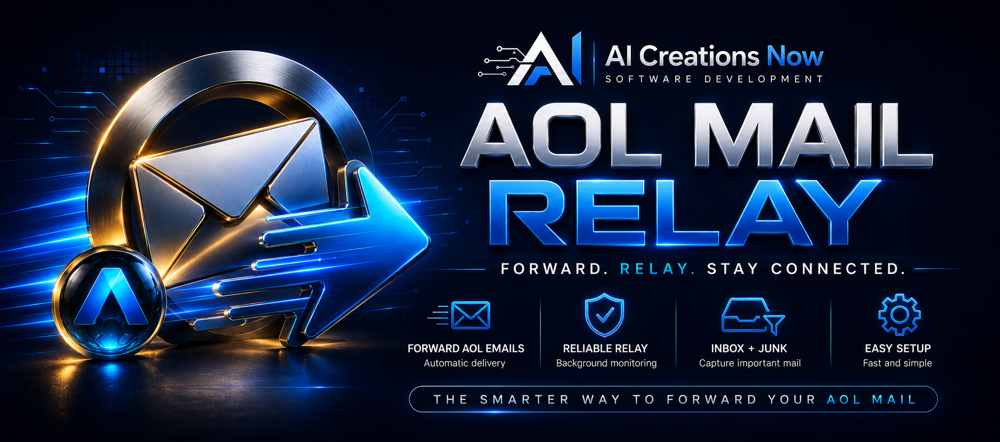

  

<h1 align="center">AOL Mail Relay System</h1>

A Windows application from **AI Creations Now Software Development** that forwards eligible new AOL Inbox messages to another email address on a schedule. Keep an established AOL address while receiving new mail at your chosen destination.

  <a href="https://aicreatenow.com/aolrelay.html">Official product page</a> · <a href="https://download.aicreatenow.com/software/AICNowAOLMailRelaySigned.exe">Download the 3-day trial</a> · <a href="https://aicreatenow.com/aolrelay.html">Buy a lifetime license — $5 USD</a>

  

## Features

- Connect to an AOL mailbox using an AOL app-specific password.
- Check the Inbox through authenticated IMAP and forward eligible messages through authenticated AOL SMTP.
- Forward normal inline message content and attachments while preserving the original messages and their read/unread status.
- Schedule checks from every 30 minutes through longer intervals of up to 24 hours.
- Run scheduled checks without leaving the dashboard open.
- Use paced five-message batches, local duplicate prevention, and failure cooldown and retry behavior.
- Review status and logs, run an immediate check, and change settings from the dashboard.
- Encrypt saved credentials and relay settings for the local Windows installation.

[Watch the product walkthrough](https://download.aicreatenow.com/media/aicreatenow/aolrelay4k.mp4).

## Requirements

- 64-bit Windows 10, Windows 11, or Windows Server with Desktop Experience.
- An AOL mailbox with an app-specific password.
- A destination email address.
- Internet access for AOL IMAP, AOL SMTP, and license activation.
- Windows powered on and awake when scheduled checks run.
- A separate license for each permanently activated computer.

## Download and setup

1. Download the [signed Windows installer](https://download.aicreatenow.com/software/AICNowAOLMailRelaySigned.exe) and install the application.
2. Configure the AOL account using its app-specific password.
3. Set the destination email address and checking interval.
4. Activate forwarding and review the dashboard and logs.

**Published version: 1.0.12.**

## Trial, price, and delivery

Try the complete application for **three days without payment**. A **$5 USD one-time payment** buys a lifetime license for **one Windows computer**. Your settings remain in place when you activate after the trial.

[Purchase through the official product page](https://aicreatenow.com/aolrelay.html). Use the contact email entered at checkout for license delivery, which can take **up to one hour**. Lifetime product updates and customer support are included.

## How forwarding works

The relay establishes a permanent fresh-mail boundary when forwarding is activated. Older mail is excluded, even if it is later marked unread or moved into the Inbox. It processes eligible **new Inbox mail**, not an entire mailbox or other mail folders.

The Windows computer must remain awake and connected for checks to run. Mail received while the computer is asleep or off remains in AOL and can be processed after the computer wakes and the relay runs again. Delivery is scheduled rather than instantaneous.

If more than **125 eligible unprocessed messages** accumulate, forwarding pauses as a protective measure. Check the dashboard and logs when forwarding requires attention.

This is an independent Windows application. It is not an AOL-hosted forwarding feature and is not affiliated with or endorsed by AOL.

## Support

Use the application's support control, email [info@aicreatenow.com](mailto:info@aicreatenow.com), or call **1-866-315-4750**.

[Product details](https://aicreatenow.com/aolrelay.html) · [Privacy policy](https://aicreatenow.com/privacy.html) · [Software refund policy](https://aicreatenow.com/cancellation.html#software-refunds)

See [support information](SUPPORT.md) for what to include when requesting help.

## Source and licensing

This repository contains documentation for proprietary software. Application source code is not included. Obtain the application and its applicable terms through the official product page.

---

Developed by [AI Creations Now Software Development](https://github.com/aicreatenowdom) · [Official software catalog](https://aicreatenow.com/software.html)
